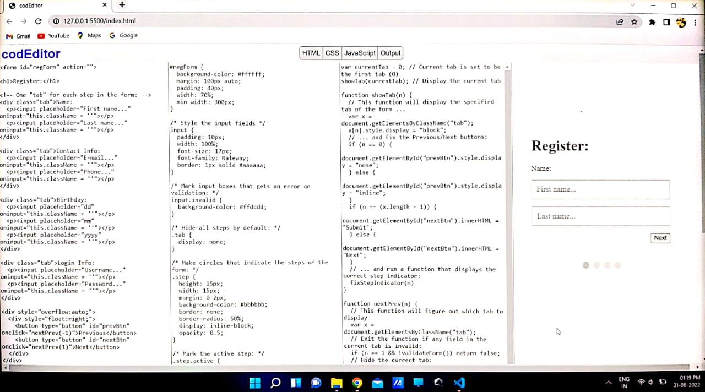

#  Code Editor
A live code editor supported by HTML, CSS and JavaScript.

## Built with
- HTML5
- CSS3
- JavaScript
- JQuery

This Project aims to create a online code editor that displays the
result in real time with the help of some HTML, CSS and
JavaScript.
The editor helps the students of the class to focus solely on
writing code, and not on setting up the surrounding framework.
# Feel Free To Use This Code
### --------------Happy Coding------------------
